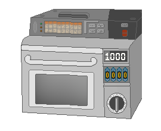

# Gadget9 Project

Based on the "Steins;Gate" series' Gadget #8, the Gadget9 Project aims to send emails to the past!
**Muahahaha!**

## How does it work ?
Gadget9 is a Google Chrome extension for composing emails that, when opened via Gmail's page with this extension installed, will have it's date altered to 7 days prior to it's delivery time.
This project also uses the DateJs library for calculating the new date.

## Requirements
It's necessary to have the Google Chrome browser installed. You must also have a Gmail account for sending the email.

## Installation
For installing the extension, [click here.](https://chrome.google.com/webstore/detail/gadget9/phdiokeehakdkmpbdhdggmjnplfdlglg)

## How to use
To compose an email, just click on the extension in the upper side of the chrome browser.
For changing the language, right click on the extension and click on "Options".

## Images

## What changed?
This new version uses gmail's api for sending mails internally and also adds support for PT-BR.
