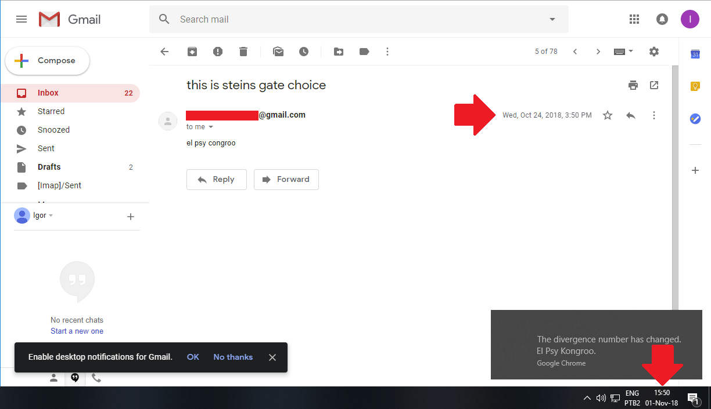

# Gadget9

Based on the "Steins;Gate" series' Gadget #8, the Reading;Steiner Project aims to send emails to the past!
**Muahahaha!**

## How does it work ?
Gadget9 is a Google Chrome extension that alters the data from emails sent from an exterior PHP server.
If the extension is installed, when you open one of these emails it's date gets changed to 7 days earlier.

## Requirements
It's necessary to have the Google Chrome browser installed. You must also have a Gmail account and bare in mind that this only works in the EN-US version of Gmail.

## Installation
For installing the extension, follow these steps:
* Download the lastest release [here](https://github.com/igorgum/gadget9/releases/download/v1.0/Extension.rar)
* Access the extensions page by pasting this URL on your browser: ```chrome://extensions/```
* Activate the "Developer mode" at the top right of the page
* Drag the "Extension" folder and release it inside the extensions page

## How to use
To compose an email, just click on on the extension in the upper side of the chrome browser.


## Images



## What changed?
The PHP Server being hosted right now is a web app authenticated through Google's api, so you can log in through it in a safe environment rather than through an unsafe SMTP server from my last project.
